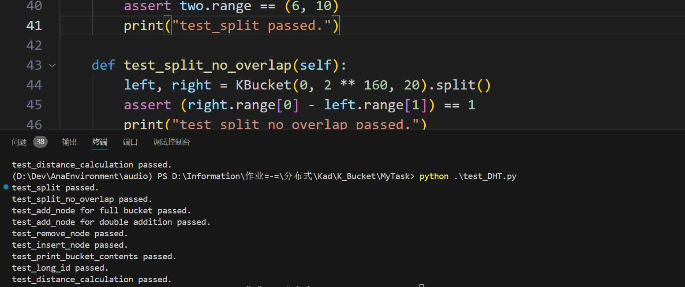

# K_Bucket

假设地址⻓度是20byte， 每个桶中节点的数量为3个

Task1：

- 实现K_Bucket中的Bucket&Node √

- 完成插入、删除、更新桶 √
- K_Bucket支持接口insertNode(nodeId) & printBucketContents() √
- 测试KBucket & Node类支持方法 √

扩展：

- 实现Peer结构
- 增加FindNode
- 功能测试

Task2：

- 实现DHT结构体
- 扩展Peer，使得包括DHT
- Peer新增SetValue & GetValue函数
- 功能测试
